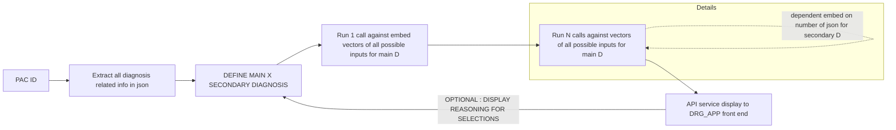

# Project Description

This project aims to automate the DRG (Diagnosis Related Group) classification process using AI.

## Project Flow

## Description
The process starts with a Patient ID (PAC ID).
1.  **Extraction**: All diagnosis-related information is extracted into a JSON format.
2.  **Definition**: The system defines the Main and Secondary diagnoses.
3.  **Vector Search (Main)**: A call is made against embedding vectors for all possible inputs to determine the Main Diagnosis.
4.  **Vector Search (Secondary)**: Multiple calls (N) are made against vectors to determine Secondary Diagnoses, dependent on the number of JSON items.
5.  **Display**: The results are displayed via an API service to the DRG App frontend.
6.  **Feedback Loop**: Optionally, the reasoning for selections is displayed and fed back into the diagnosis definition step.
